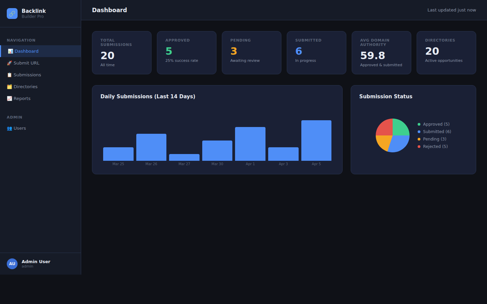
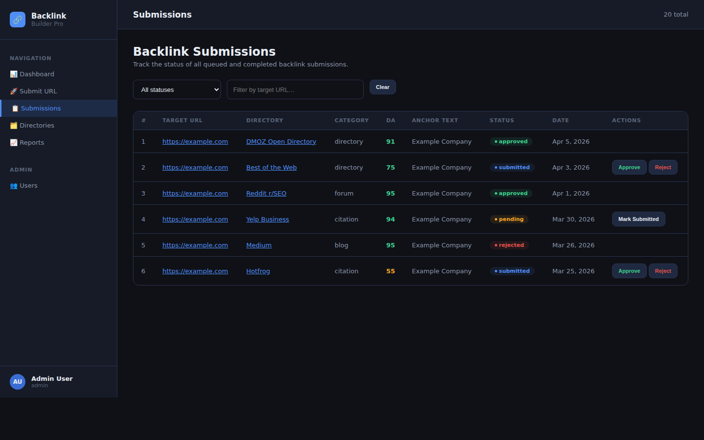

# Backlink Builder Pro

> **Private, enterprise-grade web application** for automated backlink generation — crawls open-source directories, auto-queues URL submissions, and presents results in a clean, role-based dashboard.

---

## 📸 Screenshots

### Dashboard


### Submissions Table


---

## ✨ Features

| Feature | Description |
|---|---|
| 🔐 Authentication | JWT-based login/register with role-based access control (Admin / Manager / Viewer) |
| 🚀 Bulk Submit | Queue a URL across all matching directories with one click |
| 📊 Dashboard | Live metrics: submission counts, approval rate, avg domain authority, charts |
| 📋 Submissions | Paginated table with status management and retry support |
| 🗂️ Directories | Catalogue of 20+ pre-seeded open-source directories with DA/spam filtering |
| 📈 Reports | Export CSV or JSON reports for SEO audits and client deliverables |
| �� User Management | Admin panel for enabling/disabling users and assigning roles |
| 🔄 CI/CD | GitHub Actions pipeline with test, lint, build, deploy, and rollback workflows |

---

## 🏗️ Architecture

```
backlink-builder/
├── backend/             # Python / Flask REST API
│   ├── app.py           # Application + models + routes
│   ├── requirements.txt
│   └── tests/
│       └── test_api.py  # 23 pytest test cases
├── frontend/            # React 19 + Vite SPA
│   ├── src/
│   │   ├── pages/       # Dashboard, Submit, Submissions, Directories, Reports, Users
│   │   ├── components/  # AppLayout, Sidebar
│   │   ├── hooks/       # useAuth context
│   │   └── utils/       # Axios API client with JWT refresh
│   └── package.json
├── docs/screenshots/
├── .github/workflows/
│   ├── ci.yml           # Full CI/CD pipeline
│   └── rollback.yml     # Manual rollback workflow
└── README.md
```

---

## 🚀 Quick Start

### Prerequisites
- Python 3.10+  
- Node.js 18+

### Backend

```bash
cd backend
python3 -m venv .venv && source .venv/bin/activate
pip install -r requirements.txt
python3 app.py          # → http://localhost:5000  (auto-seeds demo data)
```

### Frontend

```bash
cd frontend
npm install
npm run dev             # → http://localhost:3000
```

### Demo Credentials

| Role    | Email                   | Password      |
|---------|-------------------------|---------------|
| Admin   | admin@backlink.io       | Admin@123!    |
| Manager | manager@backlink.io     | Manager@123!  |
| Viewer  | viewer@backlink.io      | Viewer@123!   |

---

## 🔌 API Reference

| Method | Endpoint                    | Auth         | Description                |
|--------|-----------------------------|--------------|----------------------------|
| POST   | `/api/auth/register`        | —            | Register new user          |
| POST   | `/api/auth/login`           | —            | Login, returns JWT         |
| GET    | `/api/auth/me`              | ✓            | Current user profile       |
| GET    | `/api/dashboard`            | ✓            | Metrics & chart data       |
| GET    | `/api/opportunities`        | ✓            | List directories           |
| POST   | `/api/opportunities`        | Admin/Manager| Add directory              |
| GET    | `/api/submissions`          | ✓            | Paginated submissions      |
| POST   | `/api/submissions`          | ✓            | Create submission          |
| PATCH  | `/api/submissions/:id`      | Admin/Manager| Update status              |
| POST   | `/api/submissions/:id/retry`| Admin/Manager| Retry failed submission    |
| POST   | `/api/submit`               | ✓            | Bulk queue URL             |
| GET    | `/api/reports/export`       | ✓            | Export CSV or JSON         |
| GET    | `/api/users`                | Admin        | List users                 |
| PATCH  | `/api/users/:id`            | Admin        | Update role/status         |

---

## 🛡️ Security

- **JWT authentication** with 8-hour access tokens + 30-day refresh tokens
- **Role-based access control**: Admin > Manager > Viewer
- **bcrypt** password hashing
- **Spam score & DA filtering** prevents low-quality submissions
- Environment-variable secrets (never committed)

### Environment Variables

```bash
# backend/.env  (create for production)
SECRET_KEY=your-flask-secret-key
JWT_SECRET_KEY=your-jwt-secret-key
DATABASE_URL=sqlite:///backlink_builder.db   # or postgresql://...
```

---

## 🧪 Running Tests

```bash
cd backend
pytest tests/ -v --cov=app
```

**23 test cases** covering auth flows, RBAC, opportunities, submissions, bulk submit, dashboard, and exports.

---

## 📦 CI/CD

| Job                  | Trigger           | Description                          |
|----------------------|-------------------|--------------------------------------|
| `backend-ci`         | All PRs & pushes  | pytest + coverage                    |
| `frontend-ci`        | All PRs & pushes  | ESLint + Vite build                  |
| `security-audit`     | All PRs & pushes  | npm audit + pip-audit                |
| `deploy-staging`     | Push to `develop` | Deploy to staging environment        |
| `deploy-production`  | Push to `main`    | Deploy to production environment     |
| `rollback.yml`       | Manual dispatch   | Roll back production to any commit   |

---

## 📋 Submission Status Flow

```
pending → submitted → approved ✅
                    ↘ rejected ❌
       ↘ failed    → retry → pending
```

---

## 📄 License

Private — internal use only.
